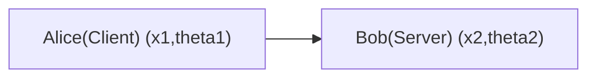

# Oblivious_Transfer_Qline

This is an implementation of oblivious transfer protocol based on Qline.

Qline: 
In each attenption of forming key pairs on one qubit, we apply operations: 

Assuming orininal qubit with state 

$|q\rangle$

We apply:

$X^{x_n} H^{theta_n} |q\rangle$ 

on each party.



# How to use

## with hwsim

- Clone and build [hw_sim](https://github.com/Veriqloud/hw_sim), obtain the executable **sim**.

- Clone and build [gc](https://github.com/Veriqloud/kiwi_hw_control), obtain the executable **gc_alice** and **gc_bob**. 

- Generate config files by [kiwi_hw_control/config/gen_cinfig](https://github.com/Veriqloud/kiwi_hw_control)

- Run hardware simulations and gc program in 4 different terminals in sequence via the generated config files.

For example, arrange the config files in *kiwi_hw_control/config/sim*, then run the executables generated above in 4 terminals:
```
sim -c bob/sim.json
sim -c alice/sim.json
gc_bob -c bob/gc.json
gc_alice -c alice/gc.json
```

- Run the protocol programe on another 2 terminals:

Assuming senarios in hwsim mode, number of batches = 125, batch size = 32768, secret randomly choosen, one round.

In Oblivious_Transfer_Qline$
```
python server_run.py -m hwsim -n 125 -b 32768
python client_run.py -m hwsim -n 125 -b 32768
```
For security reasons, the protocol will abort if **number of batches * batch size < 4096**. 

## with real hardware

- Initialize Qline system
- Run the following on Bob:

```
python server_run.py -m real -n 125 -b 32768
```

- Run the following on Alice:

```
python client_run.py -m real -n 125 -b 32768
```

## result guild

There are mainly two things we want to check in the protocol output result:
- The secret message: The server should receive and show one of the messages in the file m0.txt or m1.txt without error. 
- The security bound: An index of how close we are to reach the security bound. It is mainly depend on **number of batches * batch size** and **qber**. If passed, we will see **l** with a positive value:

```
[extraction] security bound passed!! : l = xxx bits. 
```
Otherwise, we will see **l** with a negative value, meaning this is not a secure run even the .


# Protocol steps

Consider party A runs the OT protocol to party B. Meaning A has the data to be transmitted to B.

## Initial phase

Input A: m0/m1  (send one of the message)
Input B: b (decide which message to decode)

There are two versions in the initial phase: 

### hwsim version
------

- A receives her bisis **theta1** and measurement results list **x1** from Qline.
- B receives his bisis **theta2** and measurement results list **x2** from Qline. (x1 = x2)

### softsim version
------
- A randomly choose her list of **x1**, **theta1**.
- A applies the list of **x1** and **theta1** on a list of qubits and sends them to B.
- B receives the qubits and measures them with randomly choosen **theta2**. Got result **x2**.


### real hardware version
------
- A list of **theta1** and **x1**.
- B list of **theta2**, **x2** and measurement result. 

## Commit phase

- B commits the list of **x2**, **theta2** to A  following extractable equivocal commitment protocol.
- Any nodes apart from A  and B reveal their x and theta.
- A  checks 1/2 of commitment of B via extractable equivocal commitment protocol.

## Exchange phase

- A sends **theta1** to B.
- B makes a list of indices **I0** which contains a list of matched cases if **b** = 0. Also make **I1** for the non-matched one.
- B makes a list of indices **I1** which contains a list of matched cases if **b** = 1. Also make **I0** for the non-matched one.
- B filters **x2** via **I0**, obtains a matched list of **x2**, assigned as **XB**.
- B sends both **I0** and **I1** to A  in fixed order. 
- A receives **I0**, **I1**. Yet A does not know which is the matched one. Assigns them as **Ix**, **Iy**.
- A  separate **x1** into two lists via **Ix** and **Iy**, assigns as **Xx** ,**Xy**. 
- A  sends **Xx**, **Xy** to B. 

## Error correction phase

- B compute syndromes: **Sx** = H@Xx %2, **SX0** = H@X0 %2.
- B compute **X0b** = LDPC_Decoder(SX0,Sx). The decoder includes SHA256, SHAKE256. 
- To verify the protocol, **X0b** should be equal to **Xx** if **b** = 0, otherwise equal to **Xy**. 


# Figure of merit

- How many bits to be transfered per unit time. (bit/s)
- The error rate of transfered bits before error correction. (%)
- How many qubits needed in average to transfer a bit. (/bit)

# Reference

- A Practical Protocol for Quantum Oblivious Transfer from One-Way Functions, Algorithm 5
- A New Framework for Quantum Oblivious Transfer, Protocol 6 (extractable equivocal commitment)
- [SHA 256](https://docs.python.org/3/library/hashlib.html#hashlib.sha256)
- [SHAKE 256](https://pycryptodome.readthedocs.io/en/latest/src/hash/shake256.html)


# License

This project is licensed under the [GPL-3.0](LICENSE).

## Third-party dependencies

This project uses the following external libraries:
- [NumPy](https://numpy.org/) (BSD 3-Clause License)
- [SciPy](https://scipy.org/) (BSD 3-Clause License)
- [LDPC decoder](https://pypi.org/project/ldpc/?utm_source=chatgpt.com) (MIT License) 
- [LDPC matrix](https://github.com/XQP-Munich/LDPC4QKD) (GPL-3.0 License)

You must comply with the license terms of these dependencies when redistributing or modifying this project.

# Contributions

By contributing to this project, you agree that your contributions will be licensed under the GPL-3.0 License.
